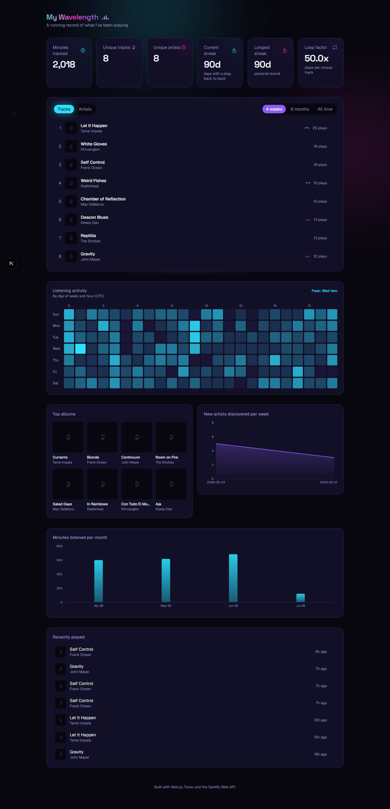

# My Wavelength — Personal Spotify Analytics Dashboard

A personal dashboard that continuously ingests my own Spotify listening history and turns it into a
warm, electric, animated analytics dashboard: top tracks/artists/albums (with day-over-day rank-change
badges), a day/hour listening activity heatmap with a peak-time callout, an artist-discovery trend
line, a monthly listening-minutes chart, streak/loop-factor stats, a recently-played feed with a
"just played" pulse, and a live "now playing" widget with a spinning vinyl — every track/artist/
album links out to Spotify.

**Live: [my-wavelength.vercel.app](https://my-wavelength.vercel.app)**



## How it works

```
Spotify Web API ──(GitHub Actions cron)──> Turso (libSQL) <──> Next.js (Vercel)
```

- A GitHub Actions workflow polls `recently-played` on a schedule and upserts new plays into a
  hosted [Turso](https://turso.tech) database, resolving artist images along the way. A second,
  daily workflow snapshots top tracks/artists — the frontend diffs consecutive snapshots to show
  ▲/▼/NEW rank-change badges on the top tracks/artists lists.
- The Next.js app (App Router, server components) reads straight from Turso to render the
  dashboard, plus a small API route that polls Spotify's `currently-playing` endpoint for the live
  "now playing" widget.
- No secrets are needed for a visitor to view the site — ingestion is fully decoupled from the
  frontend, and only I (via a stored refresh token) can write to the database.

One real constraint that shaped the feature set: Spotify deprecated the batch artist endpoint,
`audio-features`/`audio-analysis`, `recommendations`, and 30-second preview clips in 2024–2026, and
stopped returning `genres`/`popularity` on artist objects entirely. There's no tempo/key/energy or
genre data available anymore for new apps — the analytics here are built entirely from
recently-played history, top items, and track/album/artist metadata that's still exposed.

## Tech stack

Next.js (App Router) · TypeScript · Tailwind CSS · Recharts · Framer Motion · Turso (libSQL) ·
GitHub Actions · Vercel

## Local development

```bash
npm install
cp .env.example .env.local   # fill in the values below
npm run dev
```

Without `TURSO_DATABASE_URL`/`TURSO_AUTH_TOKEN` set, the app falls back to a local SQLite file
(`./local.db`) so you can build against seeded fake data before wiring up real credentials:

```bash
npm run seed   # fills local.db with plausible fake listening data
```

### Getting real data flowing

1. Create a [Spotify Developer app](https://developer.spotify.com/dashboard) (Web API only),
   with redirect URI `http://127.0.0.1:8888/callback`. Put the Client ID/Secret in `.env.local`.
2. `npm run auth` — opens a Spotify login in your browser, then prints a refresh token to paste
   into `.env.local` as `SPOTIFY_REFRESH_TOKEN`.
3. Create a free database at [Turso](https://turso.tech) (web dashboard, no CLI needed) and put
   the URL/token in `.env.local`.
4. `npm run ingest` — pulls your recently-played history and artist images into the database.

### Scripts

| Script | What it does |
| --- | --- |
| `npm run dev` | Local dev server |
| `npm run ingest` | Pull recently-played + backfill any missing metadata (what the scheduled workflow runs) |
| `npm run capture-top` | Snapshot top tracks/artists (what the daily workflow runs) |
| `npm run seed` | Fill local SQLite with fake data for UI dev without real credentials |
| `npm run auth` | One-time OAuth flow to mint a Spotify refresh token |

## Deployment

- **Vercel**: reads-only from Turso via `TURSO_DATABASE_URL`/`TURSO_AUTH_TOKEN`, plus the Spotify
  credentials for the now-playing API route. Deploys are manual (no GitHub integration wired
  up) — after pushing, run `vercel --prod` (linked to the `my-wavelength` project) to publish.
- **GitHub Actions**: `.github/workflows/ingest-recent.yml` (every 30 min) and
  `capture-top-snapshot.yml` (daily) need `SPOTIFY_CLIENT_ID`, `SPOTIFY_CLIENT_SECRET`,
  `SPOTIFY_REFRESH_TOKEN`, `TURSO_DATABASE_URL`, `TURSO_AUTH_TOKEN` set as repo secrets.
